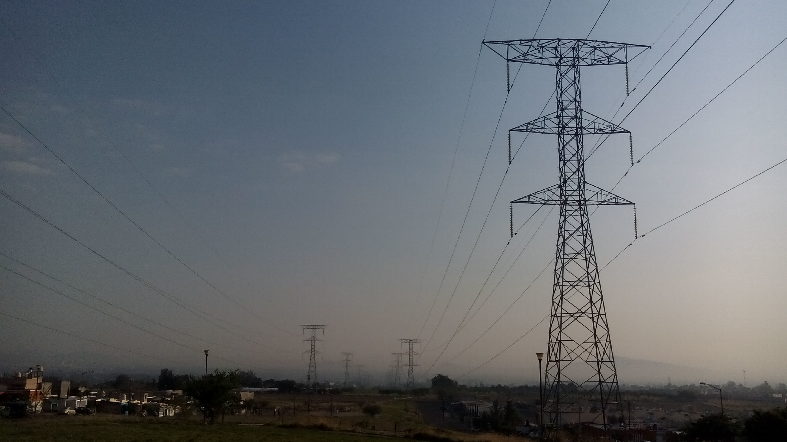

# Informe de Trabajo Parcial
###---
## Carátula
Universidad Peruana de Ciencias Aplicadas

Carrera: Ingeniería de Software

Ciclo: 2023-02

Curso: Complejidad Algorítmica

Sección: WX73

Profesor: Luis Martin Carnaval Sánchez

Tema: Optimización de Redes de Fibra Óptica de Internet

Integrantes
- Salvador Antonio Salinas Torres (U20221B127)
- Jorge Suin Yum Gonzales (U202210838)
- Daniel Elias Ruiz Huisa (U202210764)

Septiembre 2023

## Tabla de Contenidos
- [Descripción del Problema](#descripción-del-problema)
- [Descripción y Visualización del Conjunto de Datos](#descripción-y-visualización-del-conjunto-de-datos)
- [Propuesta preliminar](#propuesta-preliminar)
- [Bibliografía](#bibliografía)

## Descripción del Problema

En la era digital actual, la conectividad es el tejido que une a nuestro mundo interconectado. Las redes de comunicación son la columna vertebral que sostiene nuestras vidas cotidianas y nuestras economías globales. Entre las tecnologías que han revolucionado nuestra capacidad de comunicarnos y acceder a información de manera instantánea, la fibra óptica se destaca como una innovación fundamental. La fibra óptica, con su capacidad para transmitir datos a grandes velocidades, distancias y sin pérdidas, se ha convertido en el medio de elección para la transmisión de datos en redes de telecomunicaciones.

La fibra óptica no solo facilita la comunicación entre personas, sino también la automatización industrial, la educación en línea, comercio electrónico, entre otras aplicaciones importantes. Además, las redes de fibra óptica son esenciales para el funcionamiento eficiente de la infraestructura de Internet, el acceso a servicios en la nube y el respaldo de la creciente demanda de transmisión de datos de alta calidad.

Sin embargo, el verdadero potencial de la fibra óptica se realiza a través de la optimización continua. La optimización de las redes de fibra óptica es crucial para garantizar que los datos se transmitan de manera eficiente, segura y sin demoras en su recorrido desde el origen hasta el destino. De este modo, la latencia, capacidad y fiabilidad son factores críticos que deben ser considerados y mejorados constantemente.

## Descripción y Visualización del Conjunto de Datos

Para llevar a cabo el análisis, los datos utilizados para este análisis serán generados de forma artificial. El conjunto de datos contiene información detallada sobre la topología de la red de fibra óptica, la capacidad de ancho de banda, latencia. Igualmente, el objetivo es que el programa final sea eficiente y capaz de optimizar las redes de una fibra óptica real, con datos reales, por lo que se procurará que estos datos no se alejen mucho de la realidad.

Al tratarse de un análisis que requiere del estudio de un grafo, se tomarán en cuenta 1500 nodos de fibra óptica en la infraestructura de Internet. Cada nodo tendrá los siguientes datos:
| Dato | Descripción |
|----------|----------|
| ID | Identificador único del switch |
| Marca | Marca del switch |
| Modelo | Modelo del switch |
| Puertos | Cantidad de puertos del switch
| Ubicación | Coordenadas (latitud y longitud)
| Capacidad de ancho de banda | Capacidad que tiene para enviar datos y recibir datos en un tiempo dado

Para las aristas, se considerará la latencia que hay desde un nodo hacia otro, lo cual es importante para determinar la latencia mínima en la red.

| Dato | Descripción |
|----------|----------|
| Nodo1 | Index del primer switch |
| Nodo2 | Index del segundo switch |
| Latencia | Latencia entre ambos switches (en microsegundos) |

Una muestra de datos para un nodo.
| Dato | Ejemplo |
|----------|----------|
| ID | 76505 |
| Marca | Juniper Networks |
| Modelo | V6SV1K |
| Puertos | 12 |
| Ubicación | (89.49640570453458, 65.97759746460487) |
| Ancho de banda | 210 |

Una muestra de datos para una arista.
| Dato | Ejemplo |
|----------|----------|
| Nodo1 | 401 |
| Nodo2 | 1023 |
| Latencia | 75 |

## Propuesta preliminar

Nuestra propuesta se enfoca en la optimización de redes de fibra óptica de Internet, con el objetivo de mejorar la calidad del servicio al incrementar la eficiencia y velocidad de conexión para los usuarios. Las redes de fibra óptica cumplen un rol muy importante en la infraestructura de Internet, por lo que su optimización es esencial para garantizar que tenga un rendimiento óptimo.

De este modo, se usará nuestro programa para representar un grafo y poder determinar la latencia mínima para optimizar la red de fibra óptica. Para ello, se hará uso de la técnica del Árbol de Expansión Mínima (MST). Se utilizará el algoritmo de Kruskal para encontrar el árbol de expansión mínima en la red de fibra óptica, identificando las conexiones esenciales para mejorar la eficiencia y la redundancia de la fibra óptica. Con el MST, se logra minimizar la latencia total de la red, ya que conecta todos los nodos de manera eficiente, lo que reduce la distancia y el tiempo de viaje de los datos entre nodos.

La razón por la que elegimos el árbol de expansión mínima, es porque permite conectar todos los switches en la red de manera eficiente, garantizando que todos los switches estén conectados entre sí y que haya una ruta de comunicación entre cualquier par de switches. Esto es fundamental para garantizar la conectividad completa en la red.

Así, minimiza la suma total de las latencias en todas las aristas del grafo. Al minimizar la longitud total de las conexiones en la red, contribuye a minimizar la latencia total en la red, ya que las latencias en las fibras ópticas suelen estar relacionadas con la longitud física.

## Bibliografía

Becerra, J. (2021, 29 de julio) Fibra óptica: la conectividad que está haciendo girar al mundo. CIO México. Recuperado el 21 de septiembre de 2023 de: Becerra, J. (2021, 29 de julio) Fibra óptica: la conectividad que está haciendo girar al mundo. CIO México. Recuperado el 21 de septiembre de 2023 de: https://cio.com.mx/fibra-optica-la-conectividad-que-esta-hciendo-girar-al-mundo/

Mayta, R. (2002) Algoritmo Evolutivo para el problema de Árbol de Expansión Mínima (MST). Recuperado el 27 de septiembre de 2023 de: https://sisbib.unmsm.edu.pe/bibvirtual/publicaciones/indata/v05_n2/algorit_evo.htm

