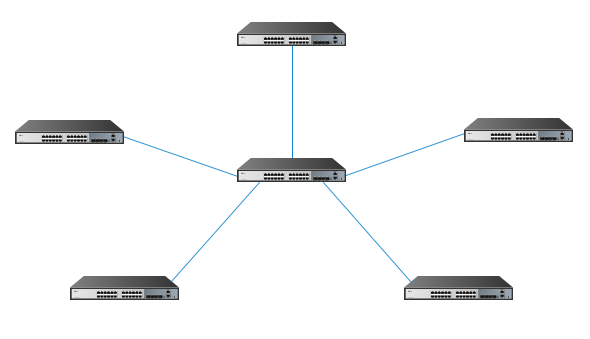
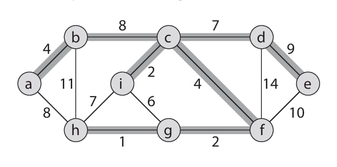
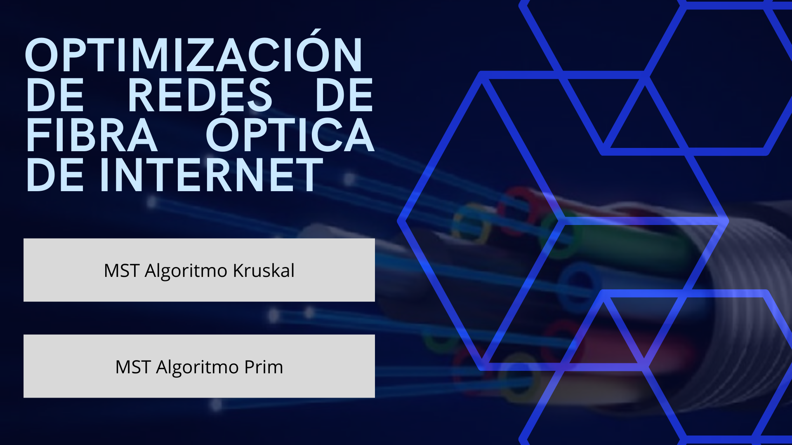
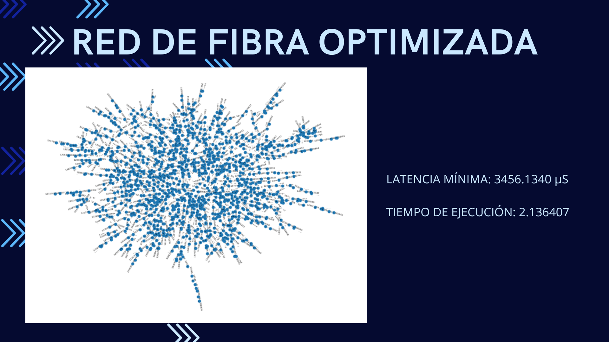
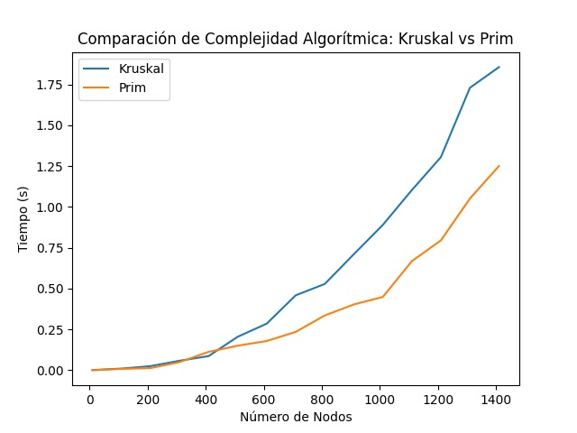

# Informe de Trabajo Parcial

## **Carátula**

**Universidad Peruana de Ciencias Aplicadas**

**Carrera:** Ingeniería de Software

**Ciclo:** 2023-02

**Curso:** Complejidad Algorítmica

**Sección:** WX73

**Profesor:** Luis Martin Canaval Sánchez

**Tema:** Optimización de Redes de Fibra Óptica de Internet

**Integrantes:**
- Salvador Antonio Salinas Torres (U20221B127)
- Jorge Suin Yum Gonzales (U202210838)
- Daniel Elias Ruiz Huisa (U202210764)

Noviembre 2023

## **Tabla de Contenidos**
- [Descripción del Problema](#descripción-del-problema)
- [Descripción y Visualización del Conjunto de Datos](#descripción-y-visualización-del-conjunto-de-datos)
- [Propuesta](#propuesta)
- [Diseño de la aplicación](#diseño-de-la-aplicación)
    - [Desarrollo de etapas de ingeniería de software](#desarrollo-de-etapas-de-ingeniería-de-software)
    - [Prototipo de diseño de interfaz de aplicación](#prototipo-de-diseño-de-interfaz-de-aplicación)
- [Validación de resultados y pruebas](#validación-de-resultados-y-pruebas)
- [Conclusiones](#conclusiones)
- [Referencias Bibliográficas](#referencias-bibliográficas)

## **Descripción del Problema**

En la era digital actual, la conectividad es el tejido que une a nuestro mundo interconectado. Las redes de comunicación son la columna vertebral que sostiene nuestras vidas cotidianas y nuestras economías globales. Entre las tecnologías que han revolucionado nuestra capacidad de comunicarnos y acceder a información de manera instantánea, la fibra óptica se destaca como una innovación fundamental. La fibra óptica, con su capacidad para transmitir datos a grandes velocidades, distancias y sin pérdidas, se ha convertido en el medio de elección para la transmisión de datos en redes de telecomunicaciones.

La fibra óptica no solo facilita la comunicación entre personas, sino también la automatización industrial, la educación en línea, comercio electrónico, entre otras aplicaciones importantes. Además, las redes de fibra óptica son esenciales para el funcionamiento eficiente de la infraestructura de Internet, el acceso a servicios en la nube y el respaldo de la creciente demanda de transmisión de datos de alta calidad.

Sin embargo, el verdadero potencial de la fibra óptica se realiza a través de la optimización continua. La optimización de las redes de fibra óptica es crucial para garantizar que los datos se transmitan de manera eficiente, segura y sin demoras en su recorrido desde el origen hasta el destino. De este modo, la latencia, capacidad y fiabilidad son factores críticos que deben ser considerados y mejorados constantemente.

## **Descripción y Visualización del Conjunto de Datos**

Para llevar a cabo el análisis, los datos utilizados para este análisis serán generados de forma artificial. El conjunto de datos contiene información detallada sobre la topología de la red de fibra óptica, la capacidad de ancho de banda, latencia. Igualmente, el objetivo es que el programa final sea eficiente y capaz de optimizar las redes de una fibra óptica real, con datos reales, por lo que se procurará que estos datos no se alejen mucho de la realidad.

Al tratarse de un análisis que requiere del estudio de un grafo, se tomarán en cuenta 1500 nodos de fibra óptica en la infraestructura de Internet. Cada nodo tendrá los siguientes datos:
| Dato | Descripción |
|----------|----------|
| `ID` | Identificador único del switch |
| `Marca` | Marca del switch |
| `Modelo` | Modelo del switch |
| `Puertos` | Cantidad de puertos del switch
| `Ubicación` | Coordenadas (latitud y longitud)
| `Ancho de banda` | Capacidad que tiene para enviar datos y recibir datos en un tiempo dado

Para las aristas, se considerará la latencia que hay desde un nodo hacia otro, lo cual es importante para determinar la latencia mínima en la red.

| Dato | Descripción |
|----------|----------|
| `Nodo1` | Index del primer switch |
| `Nodo2` | Index del segundo switch |
| `Latencia` | Latencia entre ambos switches (en microsegundos) |

Una muestra de datos para un nodo.
| Dato | Ejemplo |
|----------|----------|
| `ID` | 76505 |
| `Marca` | Juniper Networks |
| `Modelo` | V6SV1K |
| `Puertos` | 12 |
| `Ubicación` | (89.49640570453458, 65.97759746460487) |
| `Ancho de banda` | 210 |

Una muestra de datos para una arista.
| Dato | Ejemplo |
|----------|----------|
| `Nodo1` | 401 |
| `Nodo2` | 1023 |
| `Latencia` | 75 |

## **Propuesta**

Nuestra propuesta se enfoca en la optimización de redes de fibra óptica de Internet, con el objetivo de mejorar la calidad del servicio al incrementar la eficiencia y velocidad de conexión para los usuarios. Las redes de fibra óptica cumplen un rol muy importante en la infraestructura de Internet, por lo que su optimización es esencial para garantizar que tenga un rendimiento óptimo.

De este modo, se usará nuestro programa para representar un grafo y poder determinar la latencia mínima para optimizar la red de fibra óptica. Para ello, se hará uso de la técnica del Árbol de Expansión Mínima (MST). Se utilizarán los algoritmos de Kruskal y de Prim para encontrar el árbol de expansión mínima en la red de fibra óptica, identificando las conexiones esenciales para mejorar la eficiencia y la redundancia de la fibra óptica. Con el MST, se logra minimizar la latencia total de la red, ya que conecta todos los nodos de manera eficiente, lo que reduce la distancia y el tiempo de viaje de los datos entre nodos.

El **algoritmo de Kruskal** es un algoritmo que construye el árbol de expansión mínima seleccionando aristas en orden ascendente según sus pesos, utilizando conjuntos disjuntos. Para empezar, se inicializa un arreglo que almacena todos los aristas y otro donde se almacenan todos los nodos, en el que cada uno tiene su propio conjunto disjunto. Luego, se ordenan todas las aristas según sus pesos y se va eligiendo la arista mínima. Si los nodos de la arista pertenecen a conjuntos diferentes, se agrega al árbol de expansión mínima y se unen los dos conjuntos. Este proceso se repite hasta que todos los nodos pertenecen a un solo conjunto y se tengan n - 1 aristas en el árbol.

El **algoritmo de Prim** es otro algoritmo que comienza con un nodo inicial y añade iterativamente la arista menor que conecta un nodo dentro del árbol con otro nodo fuera de él. Primero selecciona un nodo como la raíz del grafo, y a partir de ese, elige la arista con el menor peso que conecta con otro nodo. Para ello también se tiene un arreglo de visitados para tener control sobre el árbol y no se produzcan bucles. De este modo, se van agregando los nodos al árbol cuando se halle la mínima distancia hacia este, y se repiten los pasos hasta que todos los nodos están conectados en el árbol de expansión mínima.

La razón por la que elegimos el árbol de expansión mínima, es porque permite conectar todos los switches en la red de manera eficiente, garantizando que todos los switches estén conectados entre sí y que haya una ruta de comunicación entre cualquier par de switches. Esto es fundamental para garantizar la conectividad completa en la red.

Así, minimiza la suma total de las latencias en todas las aristas del grafo. Al minimizar la longitud total de las conexiones en la red, contribuye a minimizar la latencia total en la red, ya que las latencias en las fibras ópticas suelen estar relacionadas con la longitud física.

En adición, tomando en cuenta que implementaremos ambos algoritmos, podemos realizar una prueba y análisis de complejidad algorítmica para saber cual es más eficiente. Para esto, se registraría en primer lugar los componentes del dispositivo ejecutando ambos algoritmos, la adición de un algoritmo que mida el tiempo del inicio hasta el final con ambos algoritmos de conexión y ordenar los datos para generar un gráfico que compare la eficiencia de los Algoritmos con relación al tiempo.

## **Diseño de la aplicación**

### **Desarrollo de etapas de ingeniería de software**

Para el proceso de diseño del aplicativo que se enfocará en la optimización de redes de fibra óptica mediante un árbol de expansión mínima, se siguieron las etapas de la ingeniería de software, las cuales nos permitieron identificar las fases del ciclo de vida de desarrollo de software.

Para comenzar, se identificaron y analizaron detalladamente los requisitos y funcionalidades del aplicativo. Esto se empezó a trabajar desde la identificación del problema de la red de fibra óptica y como se espera que el programa sea capaz de hallar una optimización de esta.

Luego, se realizó el análisis de los requisitos para saber lo que necesitábamos, lo cual se trabajó con la descripción del dataset, en el cual se especifica que se trabajará con los nodos que representan los switches y las aristas que representan las latencias entre estos.

Además, con esto también se definió el diseño de los datos, se establecieron las estructuras de datos necesarias para el almacenamiento eficiente de información crítica, como la representación de la red de fibra óptica y sus atributos asociados en un grafo no dirigido. Estos datos son fundamentales para la ejecución del algoritmo de Kruskal, el cual fue seleccionado para el proceso de optimización. Se encuentran dos datasets: [nodos.csv](/datasets/nodos.csv) y [aristas.csv](/datasets/aristas.csv).

Los algoritmos a utilizar son diseñados e implementados en el contexto del aplicativo, considerando a las complejidades temporales y espaciales, asegurando una ejecución eficiente orientada en redes de gran escala. Esto es importante, tomando en cuenta que el grafo tiene 1500 nodos, lo cual influye bastante en la eficiencia del programa.

En cuanto a la interfaz de usuario, se desarrolla una interfaz intuitiva que permite a los usuarios interactuar fácilmente con el programa, con lo cual también se muestra una presentación clara de los resultados, facilitando la comprensión de las mejoras en la optimización de la red de fibra óptica. La aplicación se desarrollará en el archivo [main.py](main.py), en el cual se encuentra un avance la lectura del dataset, los algoritmos, así como una prueba del funcionamiento de los algoritmos.

Para lograr un buen desarrollo del proyecto, utilizamos GitHub para manejar un repositorio, en el cual se realiza la documentación de este reporte, los datasets y el programa. Así como también establecimos una comunicación frecuente a través de un grupo de WhatsApp y organizamos reuniones presenciales en los cubículos de la universidad para compartir ideas y desarrollar el trabajo con mayor fluidez.

En resumen, el diseño del aplicativo se llevó a cabo de manera integral, abordando cada etapa con atención a los detalles y considerando las complejidades específicas de la optimización de redes de fibra óptica. La combinación de principios de ingeniería de software y análisis de algoritmos nos permite desarrollar un aplicativo eficiente para mejorar la infraestructura de redes de fibra óptica.

### **Prototipo de diseño de interfaz de aplicación**

Para el diseño de la interfaz se propuso el siguiente modelo. El diseño consta de una pantalla de presentación, una pantalla para mostrar el MTS con el algoritmo de Prim, y una pantalla para mostrar el MTS con el algoritmo de Kruskal.

La pantalla de presentación está conformada por un label que contiene el título referente al tema abordado: la optimización de redes de fibra óptica. Además, presenta dos botones que permiten al usuario elegir qué algoritmo desea utilizar. 

La pantalla de resultado, muestra de forma gráfica el árbol de expansión mínima, junto con la latencia mínima resultante, y el tiempo de ejecución que demoró el algoritmo elegido.

## **Validación de resultados y pruebas**

Para la validación de los resultados obtenidos en la optimización de redes de fibra óptica, se llevó a cabo un análisis de complejidad algorítmica, así como pruebas prácticas con un volumen de 1500 nodos. De este modo, podemos evaluar la eficiencia de los algoritmos seleccionados y garantizar su rendimiento en escenarios de redes de gran escala.

Como datos de entrada, tenemos los datasets que almacenan la información de los 1500 switches (representados como nodos) y la información sobre las conexiones en base a la latencia entre los switches (representados como aristas), las cuales permiten crear un grafo sobre el cual trabajar.

A partir de este grafo, se aplicaron los algoritmos de Prim y Kruskal para hallar el árbol de expansión mínima para la optimización de la red de fibra óptica. De este modo, la salida del programa es el resultado de la latencia mínima a partir de este árbol creado y el tiempo de ejecución que demoró cada algoritmo.

En la prueba de ambos algoritmos se pudo verificar que cada uno trabaja de manera distinta, y tienen distintos tiempos de ejecución al realizar la prueba. Recordando que para Kruskal su complejidad algorítmica es O(E log V) y Prim es O(E + V log V) si V son los nodos y E las aristas, se identifica que Prim es más rápido con una cantidad densa de nodos pero kruskal es más rápido con una cantidad corta de datos. Creando subgrafos con cantidades incrementales de nodos la complejidad se calculó para nuestro caso con los siguientes resultados en la siguiente máquina.

Procesador: Intel(R) Core(TM) i7-8700K CPU @ 3.70GHz   3.70 GHz

RAM: 32GB

Este gráfico muestra la efectividad que tiene Prim sobre Kruskal al usar una gran cantidad de datos y probando la veracidad de la complejidad algorítmica teórica.

## **Conclusiones**

En conclusión, en este trabajo se logró el principal objetivo de optimizar una red de fibra óptica de internet, aplicando la teoría de grafos y el árbol de expansión mínima. Se eligió el árbol de expansión mínima ya que garantiza la conectividad total de todos los nodos dentro de la red y asegurando que se logre reducir la latencia en la red de fibra óptica.

La propuesta incluye la implementación de los algoritmos de Prim y Kruskal, los cuales son buenos métodos utilizados para el MST. Además, realizamos el análisis y validación de los resultados obtenidos para demostrar la eficacia de cada uno y cuál es el más adecuado a utilizar para el caso.

Igualmente, aún hay más para investigar, ya que otra acción para poder optimizar una red de fibra óptica puede ser la mejora de flujo de datos de la red, para la cual aplica la teoría de flujo máximo y lograr maximizar la cantidad de datos que fluyen en la red. Para ello, se puede hacer uso del algoritmo de Ford-Fulkerson, junto con lo cual se utiliza también la búsqueda de grafos como BFS y DFS.

## **Referencias Bibliográficas**

Becerra, J. (2021, 29 de julio) Fibra óptica: la conectividad que está haciendo girar al mundo. CIO México. Recuperado el 21 de septiembre de 2023 de: Becerra, J. (2021, 29 de julio) Fibra óptica: la conectividad que está haciendo girar al mundo. CIO México. Recuperado el 21 de septiembre de 2023 de: https://cio.com.mx/fibra-optica-la-conectividad-que-esta-hciendo-girar-al-mundo/

Mayta, R. (2002) Algoritmo Evolutivo para el problema de Árbol de Expansión Mínima (MST). Recuperado el 27 de septiembre de 2023 de: https://sisbib.unmsm.edu.pe/bibvirtual/publicaciones/indata/v05_n2/algorit_evo.htm

